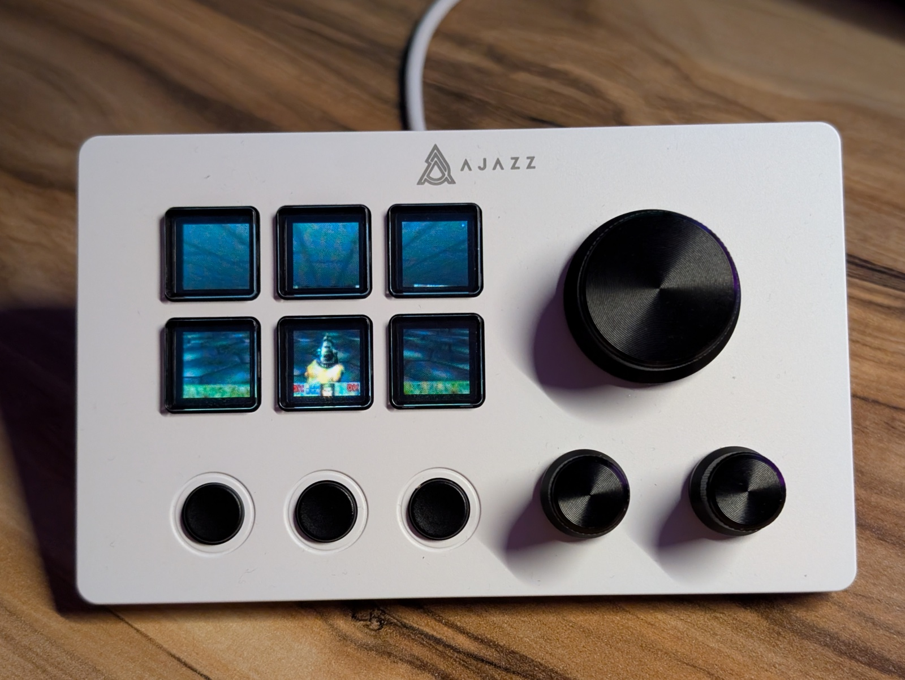

# Ajazz SDK [](https://github.com/mishamyrt/ajazz-sdk/actions/workflows/qa.yaml)

Rust library for interacting with Ajazz Stream Docks.

## Installation

```bash
cargo add ajazz-sdk
```

## Supported devices

- Ajazz AKP153
- Ajazz AKP153E
- Ajazz AKP153R
- Ajazz AKP815
- Ajazz AKP03
- Ajazz AKP03E
- Ajazz AKP03R
- Ajazz AKP03RV2

## Features

- Reading events from the device.
- Setting a custom boot logo.
- Setting a custom button image.

## Usage

```rust
use ajazz_sdk::{new_hidapi, Ajazz};

// Create instance of HidApi
let hid = new_hidapi();

// List devices and unsafely take first one
let (kind, serial) = Ajazz::list_devices(&hid).remove(0);

// Connect to the device
let mut device = Ajazz::connect(&hid, kind, &serial)
    .expect("Failed to connect");

// Print out some info from the device
println!(
    "Connected to '{}' with version '{}'",
    device.serial_number().unwrap(),
    device.firmware_version().unwrap()
);

// Set device brightness
device.set_brightness(35).unwrap();

// Use image-rs to load an image
let image = image::open("no-place-like-localhost.jpg").unwrap();

// Write it to the device
device.set_button_image(5, image).unwrap();

// Flush
device.flush().unwrap();
```



More examples can be found in the [examples](examples) directory:

- [pizza](examples/pizza) - Running pizza, that eats blue dots. Reacts on button presses and encoder twists. Uses async features.
- [boot_logo](examples/boot_logo.rs) - Setting a custom boot logo.
- [events](examples/events.rs) - Reading events from the device.
- [screen_mirroring](examples/screen_mirroring) - Mirroring the screen of the computer to the screen of the device.

## Trademarks

`ajazz-sdk` is an unofficial product and is not affiliated with Ajazz company.
